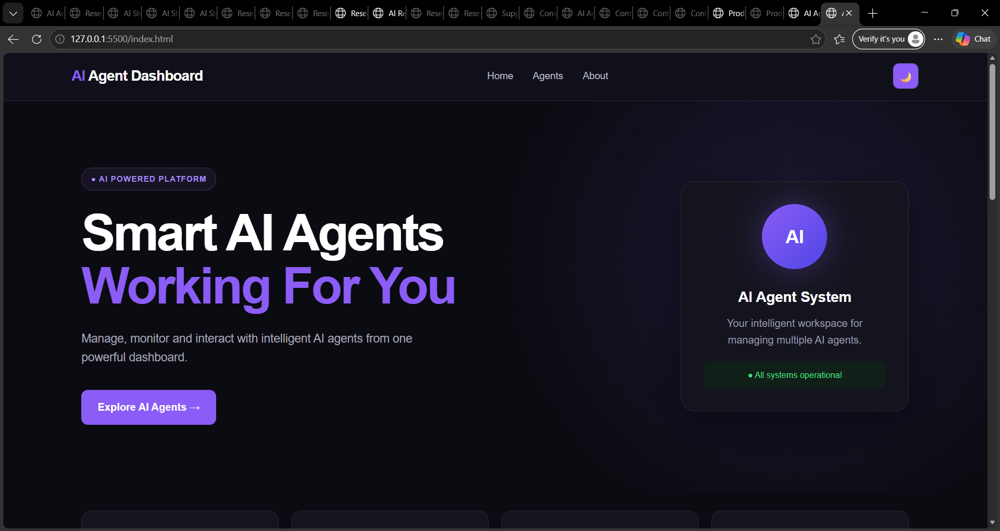
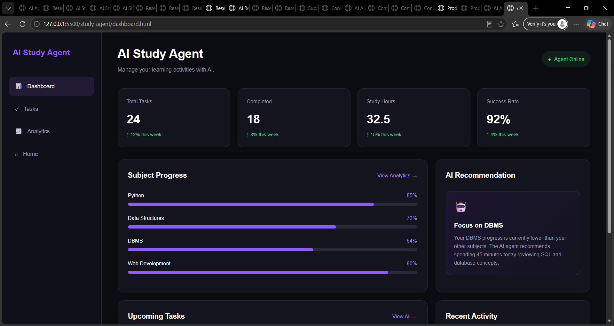
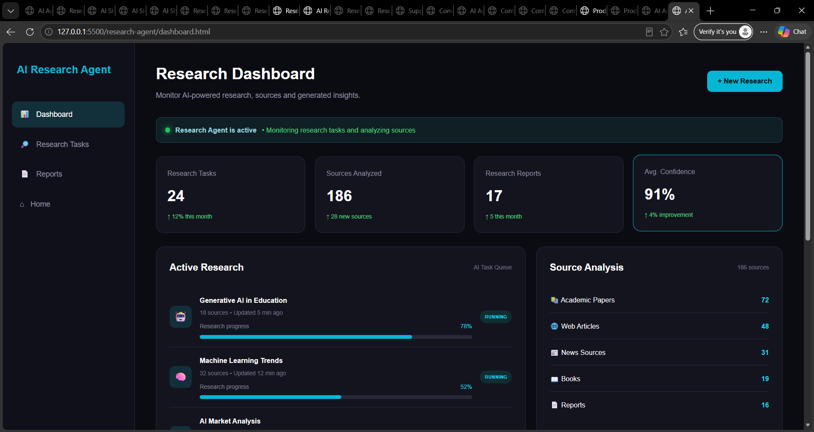
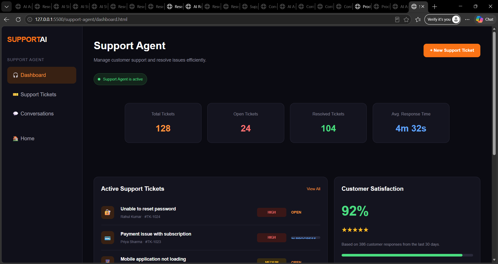
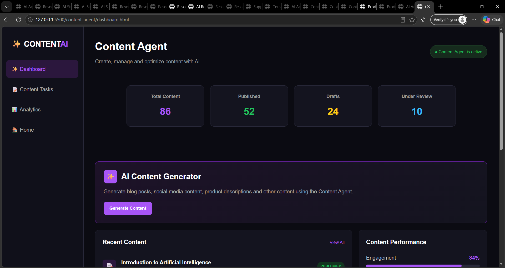
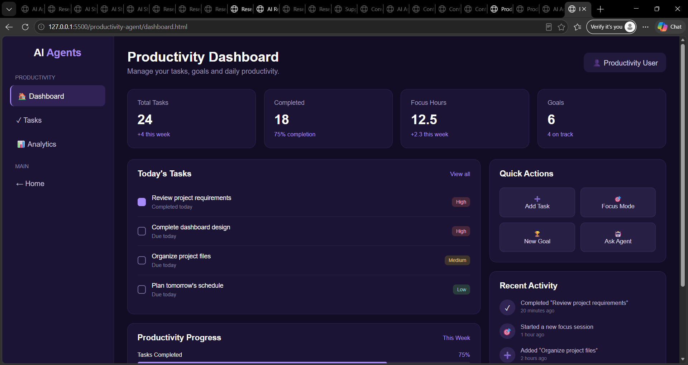

# 🤖 AI Agent Dashboard

A modern and responsive web-based **AI Agent Dashboard** designed to manage and explore multiple AI applications from a single interface.

The project contains five different AI agents, each with its own dashboard, tasks, conversations/reports, and analytics pages.

---
## 👨‍🎓 Student Details

**Name:** Sangam Dilip Reddy  
**Section:** 6

## 🚀 Project Overview

The **AI Agent Dashboard** is a frontend web application built using:

- HTML5
- CSS3
- JavaScript

The main dashboard provides access to multiple AI agents through a clean and modern user interface.

### AI Agents

1. 🎓 AI Study Agent
2. 🔬 AI Research Agent
3. 💬 AI Customer Support
4. ✍️ AI Content Agent
5. ⚡ AI Productivity Agent

---

## ✨ Features

### 🏠 Main Dashboard

- Modern landing page
- AI agent overview
- Agent status indicators
- Statistics section
- About section
- Responsive design
- Dark/light theme support

### 🎓 AI Study Agent

Helps manage:

- Study activities
- Learning tasks
- Academic progress
- Study analytics

Pages:

- Dashboard
- Tasks
- Analytics

### 🔬 AI Research Agent

Designed for:

- Research activities
- Research tasks
- Information analysis
- Report management

Pages:

- Dashboard
- Tasks
- Reports

### 💬 AI Customer Support

Designed for:

- Customer conversations
- Support activities
- Conversation management
- Support monitoring

Pages:

- Dashboard
- Conversations
- Activity
- Tickets

### ✍️ AI Content Agent

Designed for:

- Content creation
- Content tasks
- Content management
- Performance analytics

Pages:

- Dashboard
- Tasks
- Analytics

### ⚡ AI Productivity Agent

Designed for:

- Task organization
- Workflow management
- Productivity tracking
- Execution analytics

Pages:

- Dashboard
- Tasks
- Analytics

---

## 📁 Project Structure

```text
AI Agent Dashboard/
│
├── index.html
├── README.md
│
├── css/
│   └── style.css
│
├── js/
│   └── script.js
│
├── assets/
│   ├── images/
│   └── icons/
│
├── study-agent/
│   ├── dashboard.html
│   ├── tasks.html
│   └── analytics.html
│
├── research-agent/
│   ├── dashboard.html
│   ├── tasks.html
│   └── reports.html
│
├── support-agent/
│   ├── dashboard.html
│   ├── conversations.html
│   └── activity.html
│
├── content-agent/
│   ├── dashboard.html
│   ├── tasks.html
│   └── analytics.html
│
└── productivity-agent/
    ├── dashboard.html
    ├── tasks.html
    └── analytics.html

## 📸 Project Screenshots

### 🏠 Homepage



### 🎓 Study Agent



### 🔬 Research Agent



### 💬 Customer Support Agent



### ✍️ Content Agent



### ⚡ Productivity Agent

